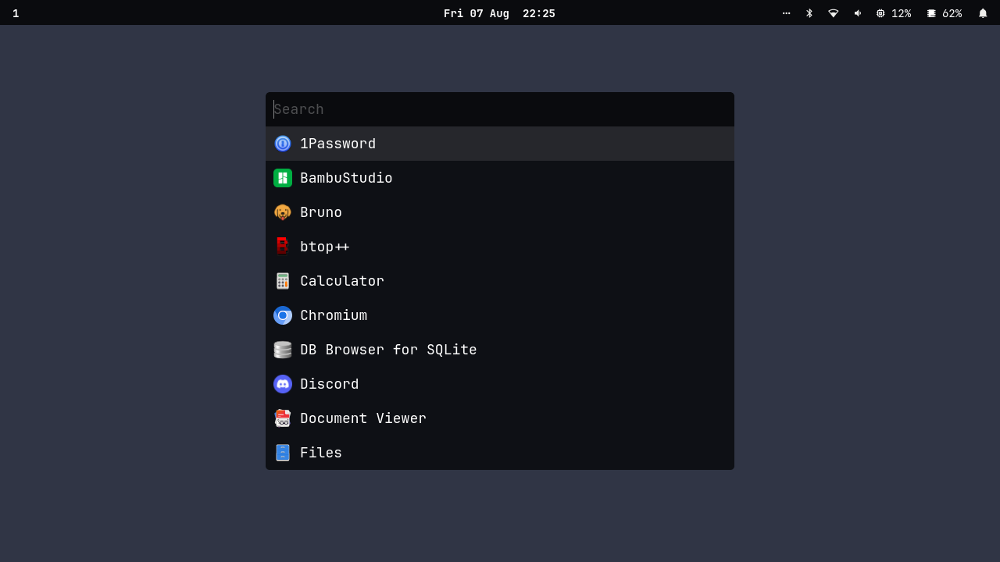
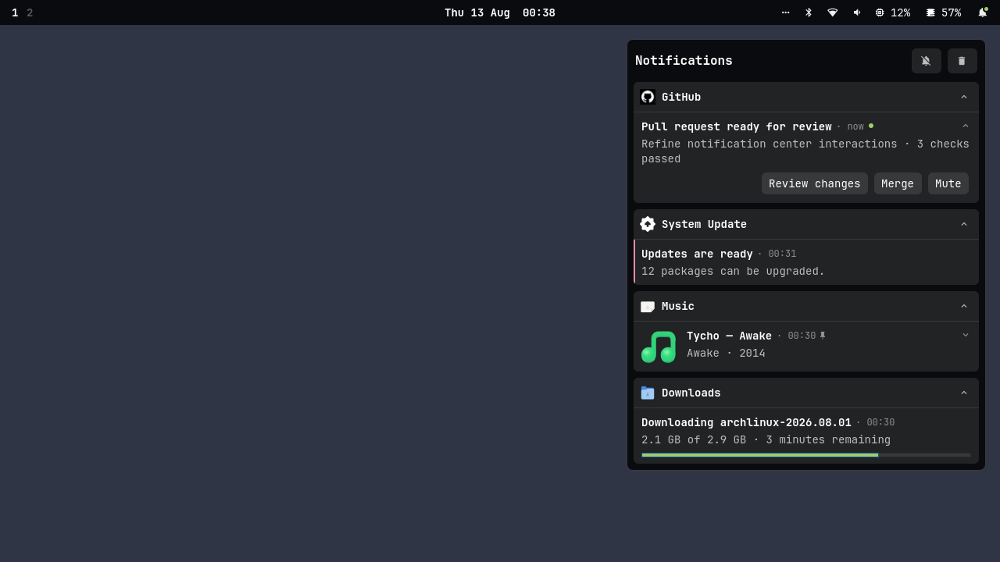

# Varde

A small, personal desktop shell for Hyprland, written in Rust with GTK 4.





Varde provides a status bar, application and clipboard launchers,
notifications, workspace controls, system status, idle inhibition, privacy
indicators, and a StatusNotifier tray. It is configured directly in the source.

## Try it

Varde provides a bar and the `org.freedesktop.Notifications` service. Stop any
conflicting bar or notification daemon, then run it from a Hyprland session:

```sh
git clone https://github.com/jochimvd/varde.git
cd varde
cargo run --release -- start
```

## Requirements

Build dependencies: a current Rust toolchain, GTK 4.12 or newer, and
gtk4-layer-shell.

Runtime dependencies: Hyprland, PipeWire, WirePlumber, iwd, BlueZ, iproute2,
PulseAudio utilities, `uwsm-app`, and JetBrains Mono Nerd Font. Notification
sounds use `canberra-gtk-play` and `sound-theme-freedesktop`.

Clipboard history requires `cliphist`, `wl-copy`, and a running watcher:

```sh
wl-paste --watch cliphist store
```

Optional bar actions use `pavucontrol`, `impala`, `bluetui`, `btop`, and
`$TERMINAL`.

## Install

```sh
cargo install --path . --locked
```

<details>
<summary>Run Varde as a systemd user service</summary>

Create `~/.config/systemd/user/varde.service`:

```ini
[Unit]
Description=Varde desktop shell
PartOf=graphical-session.target
After=graphical-session.target
Requisite=graphical-session.target

[Service]
Type=exec
ExecStart=%h/.cargo/bin/varde start
Restart=on-failure
Slice=app-graphical.slice

[Install]
WantedBy=graphical-session.target
```

```sh
systemctl --user daemon-reload
systemctl --user enable --now varde.service
```

</details>

## Use

```sh
varde launcher
varde clipboard
varde notifications
varde notifications clear
```

```sh
printf "Lock\nSuspend\nReboot\nShutdown" | varde dmenu -p "System..."
```

See `varde --help` for the complete CLI.

## Customize

The bar layout is in `src/bar/mod.rs`, modules are under `src/bar/modules/`,
and appearance is defined in `src/style.css`.

```sh
cargo install --path . --locked
systemctl --user restart varde.service
```

## Development

See [docs/development.md](docs/development.md).
