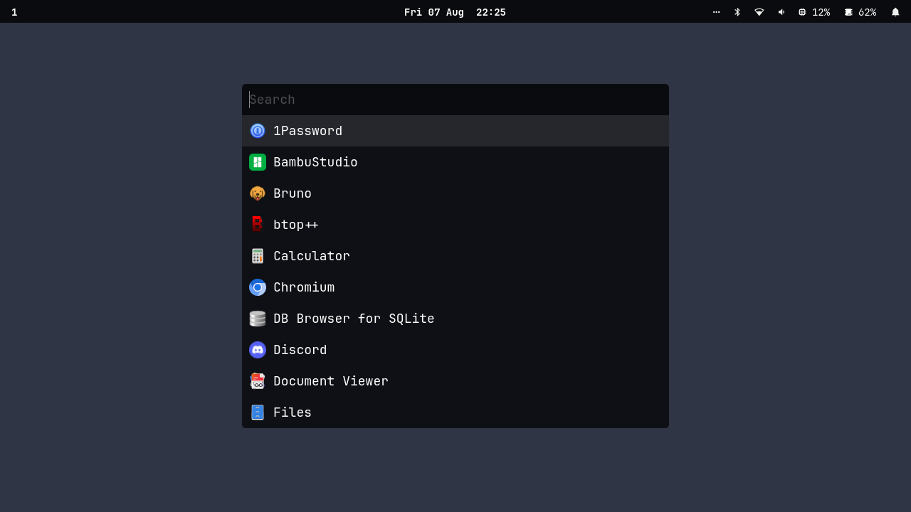
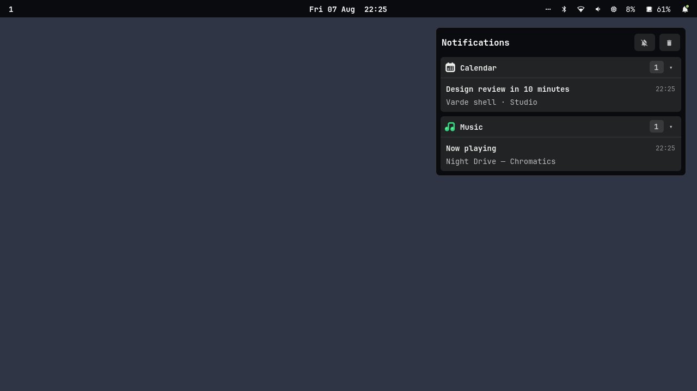

# Varde

A small, personal desktop shell for Hyprland, written in Rust with GTK 4.





Varde provides a status bar, application, action, and clipboard launchers,
notifications, workspace controls, system status, idle inhibition, privacy
indicators, and a StatusNotifier tray. The shell is configured directly in the source; launcher actions use TOML.

## Try it

Varde provides a bar and the `org.freedesktop.Notifications` service. Stop any
conflicting bar or notification daemon, then run it from a Hyprland session:

```sh
git clone https://github.com/jochimvd/varde.git
cd varde
cargo run --release -- start
```

## Requirements

Build dependencies: a current Rust toolchain, GTK 4.12 or newer, and
gtk4-layer-shell.

Runtime dependencies: Hyprland, PipeWire, WirePlumber, iwd, BlueZ, iproute2,
PulseAudio utilities, `uwsm-app`, and JetBrains Mono Nerd Font. Notification
sounds use `canberra-gtk-play` and `sound-theme-freedesktop`.

Clipboard history requires `cliphist`, `wl-copy`, and a running watcher:

```sh
wl-paste --watch cliphist store
```

Optional bar actions use `pavucontrol`, `impala`, `bluetui`, `btop`, and
`$TERMINAL`.

## Install

```sh
cargo install --path . --locked
```

<details>
<summary>Run Varde as a systemd user service</summary>

Create `~/.config/systemd/user/varde.service`:

```ini
[Unit]
Description=Varde desktop shell
PartOf=graphical-session.target
After=graphical-session.target
Requisite=graphical-session.target

[Service]
Type=exec
ExecStart=%h/.cargo/bin/varde start
Restart=on-failure
Slice=app-graphical.slice

[Install]
WantedBy=graphical-session.target
```

```sh
systemctl --user daemon-reload
systemctl --user enable --now varde.service
```

</details>

## Use

```sh
varde launcher
varde actions
varde clipboard
varde notifications
varde notifications clear
```

```sh
printf "Lock\nSuspend\nReboot\nShutdown" | varde dmenu -p "System..."
```

See `varde --help` for the complete CLI.

## Submap hints

The bar shows the active Hyprland submap, then its available keys after a short
delay. Give related bindings the same short `description` to display them as
one action: HJKL and arrow bindings labeled `Move` become `hjkl/←↓↑→ Move`.
Modifiers remain separate, and bindings without descriptions stay individual.
Use `Exit` or `Cancel` for escape bindings to keep them visible when space is
limited. Overflow is shown as `+N more`; hover for the full grouped list.

## Launcher actions

Type `>` in the application launcher or run `varde actions` to open the action
menu. Text after `>` searches action names and commands. Remove the prefix to
return to applications. Running `varde actions` again closes the action menu.

Define actions in `$XDG_CONFIG_HOME/varde/actions.toml`, defaulting to
`~/.config/varde/actions.toml`:

```toml
[[actions]]
name = "Restart audio"
command = 'systemctl --user restart pipewire'

[[actions]]
name = "Take screenshot"
command = '"$HOME/scripts/screenshot.sh"'

[[actions]]
name = "Save timestamp"
command = '''
mkdir -p "$HOME/notes"
date >> "$HOME/notes/timestamps.txt"
'''
```

The file is read whenever the action menu opens, including when switching into
it with `>`. A missing file gives an empty menu; invalid configuration shows an
error in the launcher.

Selecting an action starts `bash -c` with the configured command and closes the
menu. Commands inherit Varde's environment and working directory; use absolute
paths or `$HOME` for scripts. No interactive shell configuration is loaded and
no terminal is opened automatically. For an interactive command, launch your
terminal explicitly in `command`. Output and command failures go to Varde's
logs (the user journal when running as a service).

## Customize

The bar layout is in `src/bar/mod.rs`, modules are under `src/bar/modules/`,
and appearance is defined in `src/style.css`.

```sh
cargo install --path . --locked
systemctl --user restart varde.service
```

## Development

See [docs/development.md](docs/development.md).
